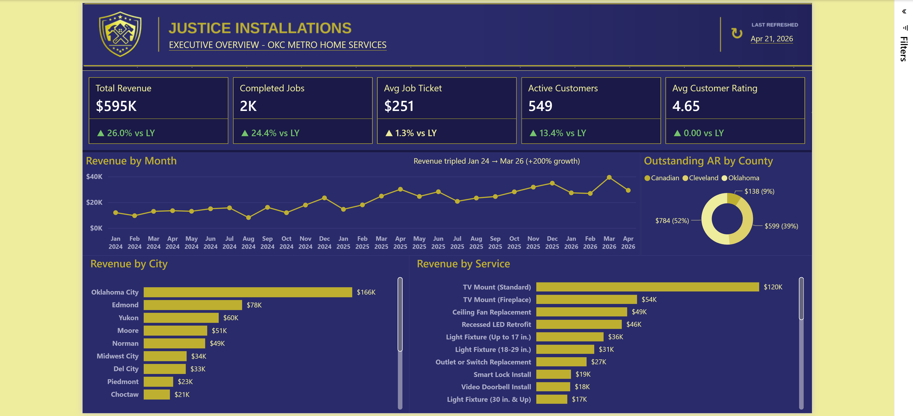
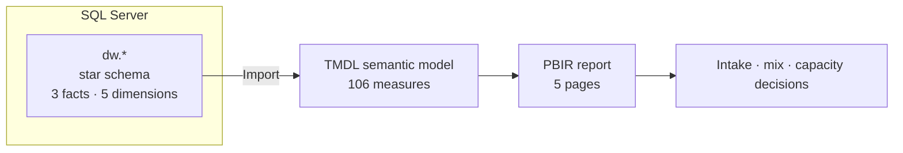
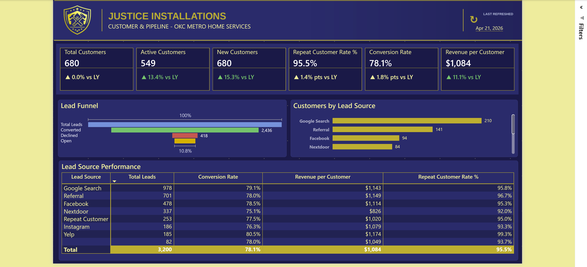

# Justice Installations — Home-Services Operations & Pipeline Analytics

**A source-controlled Power BI solution for a home-installation contractor in the Oklahoma City metro — from a SQL Server warehouse, through a TMDL semantic model, to a five-page operational report.**



> All data is synthetic. Every figure below is computed by the model in this repository — none of it is illustrative.

---

## The problem

A home-services installer lives or dies on two numbers: how many inbound requests turn into booked jobs, and how much each job is worth. Everything else — technician utilisation, service mix, geography — is downstream of those.

The trouble is that the two numbers live in different systems. Leads arrive through a website form, a phone call, or a referral. Jobs get scheduled and completed. Invoices get raised and paid. Nobody had one place to ask:

1. How is the business performing overall, and against last year?
2. Which services actually drive revenue, and how are they priced?
3. Where does revenue come from geographically, and how concentrated is it?
4. Where do customers come from, and how well do leads convert?
5. How well is the team executing, and where is volume headed?

---

## At a glance

| | |
|---|---|
| **Domain** | Home-installation services — jobs, invoicing, and lead pipeline |
| **Warehouse** | SQL Server — `dw` star schema, scripted one object per file |
| **Semantic model** | TMDL · 12 tables · 109 columns · **106 DAX measures** · 13 relationships |
| **Report** | PBIR · 5 pages · 1280 × 720 navy-and-gold theme |
| **Scale** | 2,500 jobs · 3,946 invoice lines · 3,200 leads · 680 customers · 16 cities · 31 services · Jan 2024 – Apr 2026 |
| **Source control** | PBIP / PBIR / TMDL — every visual, measure and relationship reviewable as text |

---

## Architecture



**Star schema**

| Fact | Grain | Dimensions referenced |
|---|---|---|
| `dw.FactJobs` | one row per job | Customer, City, Technician, Date |
| `dw.FactInvoiceLines` | one row per invoice line | Customer, Service, City, Technician, Date |
| `dw.FactLeads` | one row per inbound request | Customer, City, Date |

The DDL lives in [`sql/`](sql/), organised by object type, with build order in [`sql/README.md`](sql/README.md).

The model connects through two Power Query parameters (`SqlServer`, `SqlDatabase`) rather than a hard-coded connection string, and a git clean filter keeps the real hostname out of committed history — see [`docs/dev-setup.md`](docs/dev-setup.md).

---

## The report

| Page | Question it answers |
|---|---|
| **Executive Overview** | How is the business performing overall, and against last year? |
| **Service Line Performance** | Which services drive revenue, and how are they priced? |
| **Geographic Analysis** | Where does revenue come from, and how concentrated is it? |
| **Customer & Pipeline** | Where do customers come from, and how well do leads convert? |
| **Operations & Forecasting** | How well is the team executing, and where is volume headed? |

A page-by-page walkthrough — visuals and measures per page — is in [`docs/report-guide.md`](docs/report-guide.md).



---

## Findings

Every finding below is computed by the model in this repository.

### The online booking form converts worse than a human taking the request

This is the one that inverts the usual assumption. Self-service intake is supposed to be the cheap, scalable channel. Here it is the leaky one.

| Channel | Leads | Converted | Rate | Declined | Stalled |
|---|---|---|---|---|---|
| Phone / manual | 2,230 | 1,808 | **81.1%** | 10.6% | 8.3% |
| Online form | 970 | 628 | **64.7%** | 18.7% | 16.6% |

A 16.3-point gap. Online leads stall at exactly **2.00×** the manual rate and are declined at **1.76×**. And it is not a start-up wobble — the gap holds every year the data covers:

| Year | Online | Manual | Gap |
|---|---|---|---|
| 2024 | 54.5% | 74.7% | 20.2 pp |
| 2025 | 69.6% | 83.8% | 14.2 pp |
| 2026 (to Apr) | 70.1% | 83.6% | 13.5 pp |

The form is improving and has never closed the gap. The pattern — high declines *and* high stalls — points at request quality rather than follow-up effort: the form is letting people submit requests that cannot be quoted as written.

### Collections is not the problem. Intake is.

Outstanding AR is **$1,520.20 against $595,242.05 of revenue — 0.26%**. Essentially everything invoiced gets paid. There is no receivable story here.

The leak is entirely upstream. Of 3,200 inbound requests, **764 (23.9%) never become jobs**, and of those, **346 (10.8% of all leads) are neither converted nor declined** — they are sitting in *Needs Clarification*, *Pending Review* or *New*. Nobody said no. Nobody said yes.

At the average ticket of $251.05, those 346 stalled requests represent roughly **$87,000** of revenue that has neither been won nor formally lost.

### Nearly a third of revenue is one service category, and a fifth is one line item

| Category | Revenue | Share |
|---|---|---|
| TV Mounting | $175,902.00 | **29.55%** |
| Lighting | $139,724.20 | 23.47% |
| Smart Home | $61,309.85 | 10.30% |
| Fans | $61,286.95 | 10.30% |
| *remaining five* | $157,019.05 | 26.38% |

The top two categories are **53.0%** of the business. A single line item — TV Mount (Standard) — is **$120,024.45, or 20.16% of all revenue**, on 639 units. Thirty-one services are offered; the concentration sits in a handful.

### The specialists are idle, and specialising is not buying anything

| Group | Techs | Jobs | Share | Rating | Avg duration | Cancel |
|---|---|---|---|---|---|---|
| All Services | 2 | 2,034 | **81.4%** | 4.653 | 108.2 min | 4.8% |
| TV Mounting / Smart Home | 1 | 255 | 10.2% | 4.574 | 104.3 min | 4.7% |
| Lighting / Fans / Electrical | 1 | 211 | 8.4% | 4.659 | 112.9 min | 4.3% |

Two generalists carry 81% of jobs and $480,699.90 of revenue. The two specialists take 466 jobs between them — and are not measurably better at the work they specialise in. Ratings differ by less than a tenth of a star, durations by a few minutes, cancellation rates by fractions of a point. Whatever the specialist designation was meant to achieve, the data does not show it achieving it.

---

## What to do about it

### 1. Fix the booking form, not the follow-up process

**Evidence:** Online leads are declined at 1.76× and stall at 2.00× the manual rate. Both failure modes elevated together implicates the request, not the response.

**Action:** Make the form collect what a quote actually requires — mount surface and stud type for TV work, fixture height and existing wiring for lighting, a photo. Add required fields rather than optional ones. Every field that stops an unquotable request from being submitted is worth more than a faster reply to it.

**Success metric:** Online conversion within 5 points of manual, and *Needs Clarification* under 4% of online leads.

### 2. Put the 346 stalled leads on a clock

**Evidence:** 10.8% of all leads are in a non-terminal state. At $251.05 average ticket that is roughly $87,000 unresolved.

**Action:** Give *Needs Clarification*, *Pending Review* and *New* a maximum age — say seven days — after which the lead is either quoted or explicitly declined. A declined lead is a clean number. An indefinitely open one is not.

**Success metric:** Non-terminal leads under 3% of the pipeline at any month end.

### 3. Decide whether TV Mounting is the business or a risk

**Evidence:** One category is 29.55% of revenue; one line item is 20.16%.

**Action:** This is a strategy question the data raises but cannot answer. Either lean in — price the TV Mount tiers deliberately, build the attach-rate motion for soundbars and smart devices — or deliberately grow Lighting and Smart Home to dilute it. What is not defensible is holding 20% of revenue in a single SKU without having chosen to.

**Success metric:** Either TV Mount (Standard) attach rate up, or its revenue share down. Movement in a chosen direction.

### 4. Retire the specialist designation or make it mean something

**Evidence:** Specialists handle 18.6% of jobs and show no rating, duration or cancellation advantage on their own categories.

**Action:** If specialisation is real, route work to it — the scheduler should prefer the specialist for their categories, and their share of those categories should rise. If it is not real, drop the label and schedule purely on availability, which is effectively what is happening now anyway.

**Success metric:** Either specialist share of their own categories above 50%, or the designation removed from the technician dimension.

---

## How the model is built

### 106 measures in six display folders

`01 Revenue`, `02 Jobs & Operations`, `03 Leads & Pipeline`, `04 Customers`, `05 Time Intelligence`, `06 Geographic`. The YoY set follows a consistent three-measure pattern — a base measure, a `… YoY %` calculation, and a `… YoY % Display` string that formats the arrow and colour for card subtitles — so adding a new KPI to a card row is a mechanical exercise rather than a bespoke one.

### A calculation group instead of a measure explosion

`Time Intelligence` is a calculation group with seven items — `Current`, `PY`, `YoY`, `YoY %`, `YTD`, `MTD` and `Rolling 12M` — each built on `SELECTEDMEASURE()`. Dropping `Time Calc` on a visual applies any of them to whatever measure is already there, so time intelligence is seven definitions rather than seven variants of every base measure. `YoY %` carries its own `formatStringDefinition`, so the percentage formats correctly even when applied to a currency measure.

### Two disconnected tables doing presentation work

`Lead Funnel Stages` supplies the stage ordering for the pipeline funnel, which cannot come from `FactLeads` directly because the funnel stages are a projection of status, not rows. `_Page Subtitles` holds page subtitle text in the model rather than in textboxes, so subtitle copy is edited in one place.

### One thing the model does not do yet

The date dimension is set up for role-playing but only partly wired. `FactJobs` carries requested, start and end date keys; `FactInvoiceLines` carries issue and start. The model joins each fact to `Date` on exactly one of them — `StartDateKey`, `IssueDateKey` and `RequestedDateKey` respectively.

There is one inactive relationship (`Invoice Lines.StartDateKey → Date.DateKey`) and **no measure activates it** — `USERELATIONSHIP` appears nowhere in the model. So "revenue by job start date" versus "revenue by invoice issue date" is not currently a question the report can answer, even though the keys are all present to support it. That is the most obvious next piece of work.

*Contributions: measures and final assembly were built with AI assistance; the warehouse, model design and report layout are my own.*

---

## Repository

```
Justice Installations/
├── artifacts/     full-page report screenshots, one per page
├── database/      bacpac restore notes (the binary itself is not committed)
├── docs/          dev setup, report guide, naming map, data dictionary
├── pbi/           the PBIP project — report, semantic model, theme
└── sql/           dw schema DDL, organised by object type
```

### Data dictionary

[`docs/data-dictionary/Data_Dictionary.xlsx`](docs/data-dictionary/Data_Dictionary.xlsx) carries the full source-to-report lineage — object catalog, column-level dictionary, join map, measure list and build guide.

---

## Exploring it yourself

**Read it without installing anything.** The report is plain text under [`pbi/`](pbi/) — [`definition/pages/`](pbi/Justice%20Installations.Report/definition/pages/) holds one folder per page with a `visual.json` per visual, and [`definition/tables/`](pbi/Justice%20Installations.SemanticModel/definition/tables/) holds the TMDL, including every measure in [`_Measures.tmdl`](pbi/Justice%20Installations.SemanticModel/definition/tables/_Measures.tmdl).

**Open the report.** Download the `.pbix` from the [latest release](../../releases/latest). It opens in Power BI Desktop with data already imported — no database connection needed to look around.

**Rebuild it end to end.** Build the warehouse from [`sql/`](sql/), then follow [`docs/dev-setup.md`](docs/dev-setup.md) to point the parameters at your own server.

---

## Governance

### Least-privilege reporting access

The report connects as `PBIReader`, a user whose entire permission set is one grant:

```sql
CREATE USER [PBIReader] WITH PASSWORD = N'<replace-me>';
GRANT SELECT ON SCHEMA::[dw] TO [PBIReader];
```

No `db_datareader` — that role would also expose every other schema in the database. A new user starts with no permissions, so the single `GRANT` is the whole surface. The script in [`sql/Security/PBIReader.User.sql`](sql/Security/PBIReader.User.sql) includes the two `EXECUTE AS` checks that prove it worked.

### PII shape without PII

`dw.DimCustomer` carries `CustomerName`, `Email`, `Phone` and consent flags, because a real jobs-and-invoices warehouse would. The values are synthetic, and the semantic model does not surface them — it exposes `CustomerKey`, status, lead source and created date only.

### Hostname out of history

The connection is parameterised and a git clean filter substitutes a placeholder at staging time, so the repository has never contained a real server name. The filter has to be configured per clone; [`docs/dev-setup.md`](docs/dev-setup.md) explains why, and how to verify it is active.

---

## Limitations

- **The data is synthetic.** Patterns in it are the patterns the generator produced. The findings above are real conclusions about this dataset, and the analysis method transfers; the specific numbers do not describe a real business.
- **Four technicians, sixteen cities.** Small dimensions. The technician comparison in particular rests on two people per group, which is enough to observe a difference but not enough to be confident in its absence.
- **2026 is a partial year** — data runs to 21 April 2026, so any 2026 total is roughly a third of a year and not comparable to 2024 or 2025 without annualising.
- **No cost data.** Revenue, not margin. Which service lines are actually profitable is not a question this model can answer.
- **The Operations page is named "& Forecasting"** but currently carries a trend line rather than a forecast.
