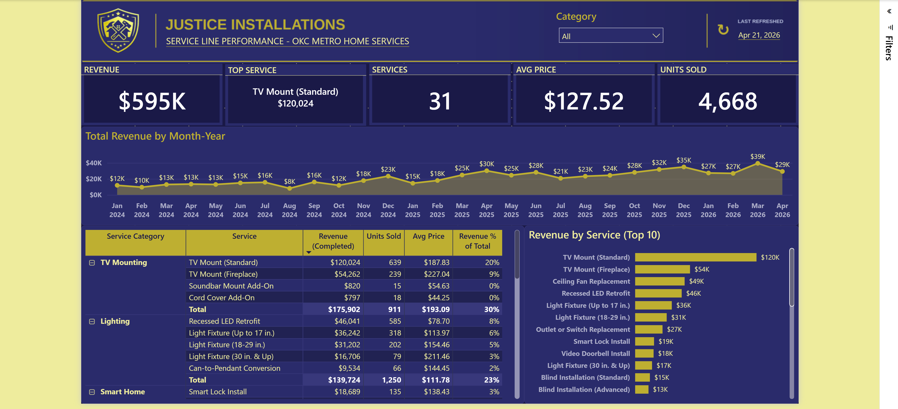
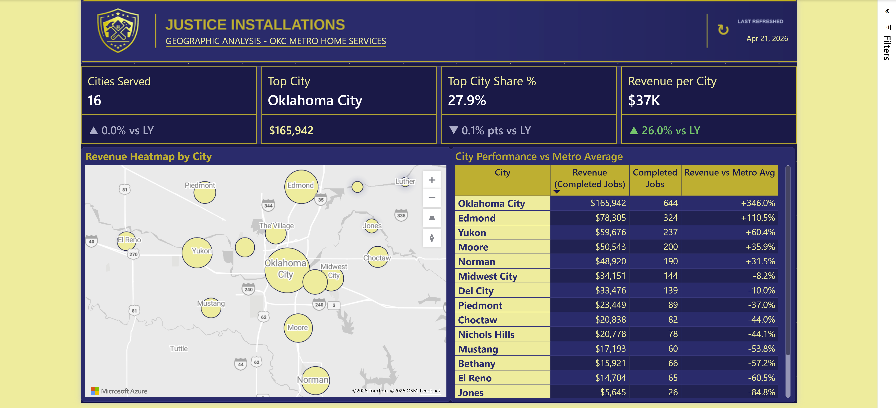
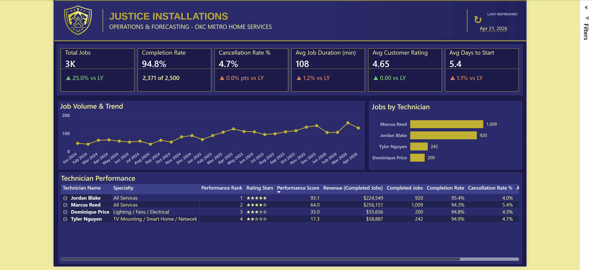

# Report Guide

A page-by-page walkthrough of the Justice Installations report: the business
question each page answers, the visuals used, and the key measures behind them.

Pages (in report order):

1. [Executive Overview](#1-executive-overview)
2. [Service Line Performance](#2-service-line-performance)
3. [Geographic Analysis](#3-geographic-analysis)
4. [Customer & Pipeline](#4-customer--pipeline)
5. [Operations & Forecasting](#5-operations--forecasting)

All five pages are built on the semantic model and read live data. Measure
definitions are documented in
[data-dictionary/Data_Dictionary.xlsx](data-dictionary/Data_Dictionary.xlsx).

Every page carries a header band with the company logo, a page title, and a
subtitle drawn from the disconnected `_Page Subtitles` table, so the subtitle
text lives in the model rather than in seven separate textboxes.

---

## 1. Executive Overview

**Question it answers:** How is the business performing overall, and how does
it compare to last year?

**Visuals**
- KPI card row — Total Revenue, Completed Jobs, Avg Job Ticket, Active
  Customers, Avg Customer Rating, each with a YoY delta.
- Line chart — Revenue (Completed Jobs) by Month-Year, annotated with the
  Jan 2024 → Mar 2026 growth callout.
- Clustered bar — Revenue (Completed Jobs) by City.
- Clustered bar — Revenue (Completed Jobs) by Service Name.
- Donut — Outstanding AR by County.

**Key measures:** `Total Revenue`, `Revenue (Completed Jobs)`, `Completed Jobs`,
`Avg Job Ticket`, `Active Customers`, `Avg Customer Rating`, `Outstanding AR`,
`Last Refreshed`, and the `… YoY % Display` set.

---

## 2. Service Line Performance

**Question it answers:** Which services drive revenue, and how are they priced
and trending?

**Visuals**
- Matrix — Service Category × Service Name, with Revenue, Units Sold, Avg
  Service Price and Revenue % of Total.
- KPI cards — Top Service With Rev, Revenue (Completed Jobs), Units Sold,
  Avg Service Price, Services Offered.
- Stacked area chart — Total Revenue by Month-Year.
- Clustered bar — Total Revenue by Service Name.
- Service Category slicer.

**Key measures:** `Revenue (Completed Jobs)`, `Total Revenue`, `Top Service`,
`Top Service With Rev`, `Services Offered`, `Avg Service Price`,
`Revenue % of Total`, `Units Sold`.

---

## 3. Geographic Analysis

**Question it answers:** Where does revenue come from geographically, and how
concentrated is it?

**Visuals**
- Azure Map — revenue by city, plotted from the latitude and longitude columns
  on `DimCity`.
- Matrix — City × Revenue, Completed Jobs, Revenue vs Metro Avg.
- KPI cards — Cities Served, Top City, Top City Share %, Revenue per City.

**Key measures:** `Cities Served`, `Top City`, `Top City Revenue`,
`Top City Share %`, `Revenue per City`, `Revenue vs Metro Avg`, and their YoY
companions.

---

## 4. Customer & Pipeline

**Question it answers:** Where do customers come from, and how well do leads
convert into repeat, high-value relationships?

**Visuals**
- KPI card row — Total Customers, Active Customers, New Customers, Repeat
  Customer Rate %, Conversion Rate, Revenue per Customer, with YoY deltas.
- Funnel — Lead Funnel Value by Stage, driven by the `Lead Funnel Stages`
  disconnected table.
- Matrix — Lead Source × Total Leads, Conversion Rate, Revenue per Customer,
  Repeat Customer Rate %.
- Clustered bar — Total Customers by Lead Source.

**Key measures:** `Total Customers`, `Active Customers`, `New Customers`,
`Repeat Customer Rate %`, `Conversion Rate`, `Conversion vs Industry pp`,
`Revenue per Customer`, `Total Leads`, `Converted Leads`, `Declined Leads`,
`Open Leads`, `Lead Funnel Value`.

> `Repeat Customer Rate %` is `Repeat Customer Jobs ÷ Completed Jobs` — the
> share of *jobs* that come from returning customers, not the share of
> customers who return. The distinction matters when reading the card.

---

## 5. Operations & Forecasting

**Question it answers:** How well is the team executing jobs, and where is
volume headed?

**Visuals**
- KPI card row — Total Jobs, Completion Rate, Cancellation Rate %, Avg Job
  Duration, Avg Customer Rating, Avg Days to Start, with YoY deltas.
- Line chart — Total Jobs by Month-Year with an analytics trend line.
- Clustered bar — Completed Jobs by Technician Name.
- Matrix — Technician × Specialty with Performance Rank, Rating Stars,
  Performance Score, Revenue and Completion Rate.

**Key measures:** `Total Jobs`, `Completion Rate`, `Cancellation Rate %`,
`Avg Job Duration (min)`, `Avg Customer Rating`, `Avg Days to Start`,
`Completed Jobs`, `Performance Rank`, `Performance Score`, `Rating Stars`.

> The page is called Operations & Forecasting, but the line chart currently
> carries a trend line rather than a forecast. Adding the forecast — or renaming
> the page — is outstanding.

---

*Screenshots referenced above live in [../artifacts/](../artifacts/) and are
captured from Power BI Desktop at the resolution the report actually renders.*
